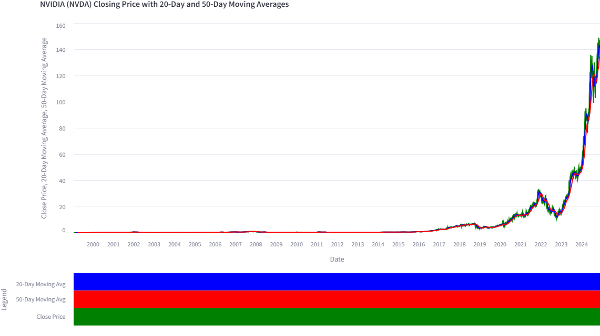
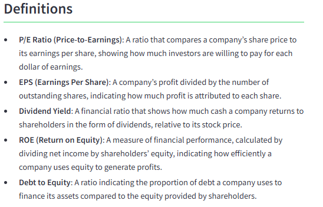

# Welcome to WhatIS NVDA

Welcome to **WhatIS NVDA**, your go-to platform for exploring all things Nvidia (NVDA). Whether you're looking for detailed stock analysis, fun facts, or the latest trends, this platform is here to help you get a clearer picture of Nvidia's role in the tech world.

## Key Features

- **Main Homepage**: Your starting point for all things Nvidia.
- **Stock Analysis**: Dive into Nvidia's stock performance with insights on trends and market behavior.
- **Fun Facts**: Explore interesting tidbits and lesser-known facts about Nvidia and its impact.
- **Interactive Tools**: Engage with interactive tools designed to help you understand Nvidia’s data in a hands-on way.

## About WhatIS NVDA

**WhatIS NVDA** is a platform designed to provide comprehensive information on Nvidia (NVDA). Our goal is to offer clear, concise, and accurate explanations to help you understand complex subjects with ease, using data visualization and practical examples.

### About Us

We started WhatIS NVDA with the intention of creating a platform that simplifies learning by breaking down complex ideas into bite-sized, digestible pieces. We are passionate about making information accessible to everyone, regardless of their background or prior knowledge. By focusing on clear, understandable explanations and effective visual aids, we aim to empower individuals to grasp difficult concepts and apply that knowledge in their own lives.

### What You Will Find Here

- Visual aids like charts, graphs, and diagrams to help clarify concepts like the following (followed with analysis on the graph and why it's important):

- Useful definitions and relevant information like the following:

- Answers to questions like "What Could You Have Bought with a $1,000 Investment in NVDA (2014-2024)?"

- And **so much more**! Visit the website to discover all the additional features and content I have in store for you.

---

Thanks for checking out **WhatIS NVDA**! I hope you find it useful and informative as you explore the world of tech stocks. If you have any questions or ideas, don’t hesitate to reach out.